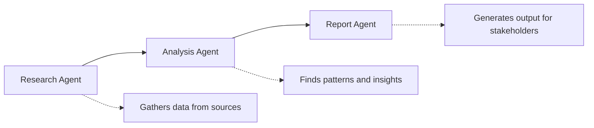

## TL;DR - Key Takeaways

1. **AI agents are autonomous** - Unlike chatbots, they execute multi-step tasks without constant human input
2. **40% of enterprise apps** will include AI agents by end of 2026
3. **Multi-agent orchestration** - Multiple specialized agents working together is the future
4. **Key use cases**: scheduling, budget management, customer service, content creation, logistics
5. **Trust and governance** remain the biggest adoption challenges

---

## What Are AI Agents?

**AI agents** are autonomous software systems that can plan, reason, and execute multi-step tasks with minimal human intervention. Unlike traditional chatbots that respond to single queries, AI agents maintain context, make decisions, and take actions across complex workflows.

### Definition

> **AI Agent**: An autonomous AI system that perceives its environment, makes decisions, and takes actions to achieve specific goals—often across multiple steps and systems—without requiring human input at each stage.

### AI Agents vs. Chatbots vs. Copilots

| Feature | Chatbot | Copilot | AI Agent |
|---------|---------|---------|----------|
| **Interaction** | Single query-response | Assists human work | Autonomous execution |
| **Context** | Limited/session-based | Task-specific | Persistent across workflows |
| **Actions** | Text responses only | Suggestions/drafts | Executes real actions |
| **Decision-making** | Rule-based | Human-guided | Autonomous |
| **Example** | Customer FAQ bot | GitHub Copilot | Autonomous scheduler |

---

## Why AI Agents Are Trending in 2026

The enterprise landscape is shifting dramatically. According to industry forecasts:

- **40% of enterprise applications** will incorporate AI agents by the end of 2026
- Companies are moving beyond "AI for insights" to "AI that acts"
- Multi-agent orchestration is redefining how complex workflows operate

### The Evolution Timeline

| Era | Technology | Capability |
|-----|------------|------------|
| 2020-2022 | Chatbots | Answer questions |
| 2023-2024 | Copilots | Assist with tasks |
| 2025-2026 | AI Agents | Execute autonomously |
| 2027+ | Agent Swarms | Coordinate at scale |

---

## How AI Agents Work

### The Agent Architecture

AI agents typically consist of four core components:

| Component | Function | Examples |
|-----------|----------|----------|
| **1. Perception** | Reads and monitors inputs | Emails, calendars, databases, real-time data streams |
| **2. Reasoning (LLM Core)** | Understands context and plans | Goal interpretation, multi-step planning |
| **3. Memory** | Stores context and history | Short-term: current task; Long-term: patterns |
| **4. Action** | Executes real-world tasks | API calls, emails, database updates, workflow triggers |

### Example: Autonomous Meeting Scheduler

Here's how an AI scheduling agent works:

1. **Perceive**: Agent receives request "Schedule a team review next week"
2. **Reason**: Checks calendars of all team members, finds conflicts
3. **Plan**: Identifies three possible time slots
4. **Act**: Sends calendar invites, books conference room, creates agenda
5. **Adapt**: If someone declines, automatically finds alternative

---

## Multi-Agent Orchestration: The Next Frontier

**Multi-agent systems** involve multiple specialized AI agents collaborating to complete complex tasks. This is where enterprise AI is heading in 2026.

### How Multi-Agent Systems Work



### Real-World Multi-Agent Example: Customer Support

| Agent | Role | Actions |
|-------|------|---------|
| **Triage Agent** | Classify incoming tickets | Routes to appropriate team |
| **Knowledge Agent** | Search documentation | Finds relevant solutions |
| **Response Agent** | Draft customer replies | Writes personalized responses |
| **Escalation Agent** | Detect complex issues | Flags for human review |
| **Analytics Agent** | Track patterns | Reports on common issues |

---

## Top Use Cases for AI Agents in Enterprise

### 1. IT Operations (AIOps)

AI agents monitor systems, detect anomalies, and auto-remediate issues:

- **Before**: Alert fires → Human investigates → Manual fix
- **After**: Agent detects issue → Diagnoses root cause → Applies fix → Reports

### 2. Financial Operations

Agents handle invoicing, expense reports, and budget tracking:

- Auto-categorize expenses
- Flag policy violations
- Generate financial reports
- Forecast budget needs

### 3. HR and Recruiting

From screening to onboarding:

- Resume screening and ranking
- Interview scheduling
- Onboarding task management
- Benefits enrollment assistance

### 4. Sales and Marketing

Lead nurturing and campaign management:

- Qualify and score leads
- Personalize outreach sequences
- A/B test campaign variations
- Generate performance reports

### 5. Software Development

Beyond code completion:

- Automated code review
- Test generation and execution
- Documentation updates
- Deployment orchestration

---

## Building AI Agents: Technical Approaches

### Popular Agent Frameworks

| Framework | Best For | Key Feature |
|-----------|----------|-------------|
| **LangChain Agents** | General purpose | Extensive tool integrations |
| **AutoGPT** | Autonomous tasks | Self-prompting capability |
| **CrewAI** | Multi-agent systems | Role-based agent teams |
| **Microsoft Semantic Kernel** | Enterprise | Azure integration |
| **OpenAI Assistants API** | Production apps | Built-in memory and tools |

### Simple Agent Pattern (Pseudocode)

```python
class AIAgent:
    def __init__(self, llm, tools, memory):
        self.llm = llm
        self.tools = tools  # APIs, databases, services
        self.memory = memory  # Context storage
    
    def run(self, goal):
        while not self.is_goal_complete(goal):
            # 1. Perceive current state
            context = self.gather_context()
            
            # 2. Reason and plan
            plan = self.llm.plan(goal, context, self.memory)
            
            # 3. Select and execute action
            action = self.select_action(plan)
            result = self.execute_action(action)
            
            # 4. Update memory
            self.memory.store(action, result)
            
            # 5. Evaluate progress
            self.evaluate_progress(goal, result)
        
        return self.compile_results()
```

---

## Challenges and Considerations

### Trust and Reliability

The biggest barrier to AI agent adoption is trust:

| Concern | Mitigation |
|---------|------------|
| **Hallucinations** | Verification steps, human checkpoints |
| **Runaway actions** | Action limits, rollback capabilities |
| **Data privacy** | Scoped permissions, audit logs |
| **Accountability** | Clear ownership, decision logging |

### Best Practices for Enterprise Adoption

1. **Start small**: Begin with low-risk, high-frequency tasks
2. **Human-in-the-loop**: Keep humans for critical decisions
3. **Comprehensive logging**: Track all agent decisions and actions
4. **Clear boundaries**: Define exactly what agents can and cannot do
5. **Gradual autonomy**: Increase independence as trust builds

---

## The Future: Agent Ecosystems

By 2027-2028, we'll see:

- **Agent marketplaces**: Pre-built agents for common business functions
- **Inter-company agents**: Agents negotiating between organizations
- **Agent standards**: Common protocols for agent communication
- **Regulatory frameworks**: Laws governing autonomous AI decisions

---

## How to Get Started with AI Agents

### For Developers

1. Experiment with OpenAI's Assistants API or LangChain agents
2. Start with a simple use case (email summarization, meeting prep)
3. Add tools incrementally (calendar, CRM, documentation)
4. Implement robust error handling and logging

### For Business Leaders

1. Identify repetitive, rule-based workflows
2. Assess which processes have clear success criteria
3. Start with internal tools before customer-facing applications
4. Plan for governance and oversight from day one

---

## Frequently Asked Questions

### What is the difference between AI agents and RPA?

RPA (Robotic Process Automation) follows pre-defined rules and scripts. AI agents use language models to understand context, make decisions, and adapt to new situations. RPA is rigid; AI agents are flexible.

### Are AI agents safe to use in production?

Yes, with proper guardrails. Implement action limits, human approval for critical decisions, comprehensive logging, and clear rollback procedures.

### How much do AI agents cost to run?

Costs vary based on LLM usage, API calls, and complexity. Simple agents might cost $0.01-0.10 per task; complex multi-agent workflows could cost $1-10+ per execution.

### Will AI agents replace jobs?

AI agents will augment human work, handling routine tasks so humans can focus on strategic, creative, and interpersonal work. Some roles will change; new roles (AI Agent Manager, Agent Trainer) will emerge.

### What's the best framework for building AI agents?

For beginners: OpenAI Assistants API. For flexibility: LangChain. For multi-agent systems: CrewAI. For enterprise: Microsoft Semantic Kernel with Azure.

---

## Conclusion

AI agents represent the next evolution in enterprise software—from tools that inform to systems that act. With 40% of enterprise applications expected to include AI agents by the end of 2026, understanding this technology isn't optional; it's essential.

The companies that master AI agent deployment will gain significant advantages in efficiency, speed, and scalability. The key is starting now, learning fast, and building trust incrementally.

---

**Last Updated:** January 2026

**Questions?** Connect on [LinkedIn](https://www.linkedin.com/in/agrawal-sumit/) or [GitHub](https://github.com/tech-sumit).
