## TL;DR - Key Takeaways

1. **Home robots went mainstream** at CES 2026 with practical, affordable options
2. **LG CLOi** debuted as a true home assistant robot butler
3. **Roborock Saros Rover** unveiled as the first vacuum that climbs stairs
4. **Humanoid robots** from multiple companies showed real-world capability
5. **Healthcare and eldercare** robots emerged as a major category

---

## The Robot Revolution at CES 2026

CES 2026 marked a turning point for robotics. After years of impressive demos that never reached consumers, this year's show featured robots that are actually shipping—or will be soon. The focus shifted from "look what's possible" to "here's what you can buy."

Let's explore the most impressive robots revealed at CES 2026.

---

## Home Robots

### LG CLOi Home Robot

> **🤖 Star of CES 2026** — LG CLOi features two articulated arms with seven degrees of freedom each, hands with five independently actuated fingers, and AI-powered facial expressions on its display head.

The star of the show. LG's CLOi (pronounced "Kloh-ee") is a true home assistant robot.

| Specification | Details |
|--------------|---------|
| **Type** | Mobile home assistant |
| **Height** | ~3 feet (90cm) |
| **Features** | Voice control, object manipulation, navigation |
| **AI** | On-device LLM + cloud hybrid |
| **Price** | TBA (expected $2,000-5,000) |
| **Availability** | Late 2026 |

**What it can do**:
- Navigate throughout your home autonomously
- Pick up and carry small objects
- Respond to voice commands
- Monitor home security
- Control smart home devices
- Provide reminders and companionship

**Why it matters**: CLOi represents the first mainstream attempt at a general-purpose home robot from a major manufacturer. LG's appliance ecosystem integration gives it an advantage.

---

### Samsung Ballie (Updated)

Samsung's rolling ball robot returned with significant upgrades.

| Specification | Details |
|--------------|---------|
| **Type** | Mobile smart home hub |
| **Form factor** | Rolling ball (~6" diameter) |
| **Features** | Projector, camera, voice assistant |
| **Integration** | SmartThings ecosystem |
| **Price** | TBA (expected $1,000-1,500) |
| **Availability** | Mid-2026 |

**What's new in 2026**:
- Built-in projector for calls and content
- Follow-me functionality for video calls
- Pet monitoring and interaction
- Improved obstacle avoidance
- Longer battery life (full day operation)

---

### Roborock Saros Rover: The Stair Climber

> **🦿 World's First** — The Saros Rover uses a wheel-leg hybrid architecture with independently articulating legs that extend to climb stairs and retract for normal floor cleaning.

The most practical innovation: a vacuum that conquers stairs.

| Specification | Details |
|--------------|---------|
| **Type** | Robot vacuum with wheel-leg architecture |
| **Key feature** | Stair climbing with articulated legs |
| **Navigation** | LiDAR + AI vision |
| **Mobility** | Independent wheel-legs for terrain adaptation |
| **Price** | Expected ~$2,000+ |
| **Availability** | Late 2026 |

**How it works**:
- Wheel-leg hybrid architecture
- Each leg extends independently for stairs and thresholds
- Balances dynamically while climbing
- Maps multi-floor homes automatically

**Why it matters**: This solves the biggest limitation of robot vacuums—they've been stuck on single floors since inception.

> **Note**: Roborock also unveiled the **Saros Z70** at CES 2026, which features a 5-axis robotic arm (OmniGrip) for picking up objects, but does not climb stairs.

---

### ECOVACS DEEBOT X8

Advanced home cleaning with manipulator arm.

| Specification | Details |
|--------------|---------|
| **Type** | Robot vacuum with arm |
| **Arm capability** | Picks up small objects |
| **AI features** | Object recognition, hazard avoidance |
| **Price** | Expected ~$1,500 |
| **Availability** | Q1 2026 |

**Unique feature**: Before vacuuming, the robot arm can pick up socks, small toys, and cables that would normally jam the vacuum.

---

## Humanoid Robots

### Figure 02

> **🧠 OpenAI-Powered** — Figure 02 stands 5'6" tall with refined gait control, advanced balance, and natural language conversation capabilities through its OpenAI partnership.

Figure AI's humanoid robot showed remarkable real-world capability.

| Specification | Details |
|--------------|---------|
| **Type** | General-purpose humanoid |
| **Height** | 5'6" (167cm) |
| **Weight** | 130 lbs (59 kg) |
| **Payload** | 45 lbs (20 kg) |
| **Battery** | 5+ hours operation |
| **AI** | Custom + OpenAI partnership |

**CES 2026 demos**:
- Natural language task instruction
- Complex object manipulation
- Autonomous warehouse navigation
- Multi-step task completion

**Target markets**: Warehouses, manufacturing, eventually homes.

---

### Tesla Optimus (Gen 3 Preview)

Tesla showed Optimus Gen 3 capabilities (though availability remains unclear).

| Specification | Details |
|--------------|---------|
| **Type** | General-purpose humanoid |
| **Height** | 5'8" (173cm) |
| **Hands** | 22 degrees of freedom |
| **Walking speed** | 5 mph |
| **Use case** | Tesla factories first, then homes |

**What Tesla showed**:
- Improved walking and balance
- Delicate object handling
- Learning from demonstration
- Factory floor tasks

---

### Unitree G1 & H1

Chinese robotics company Unitree impressed with affordable humanoids.

| Model | G1 | H1 |
|-------|-----|-----|
| **Type** | Compact humanoid | Full-size humanoid |
| **Height** | 4'3" | 5'11" |
| **Price** | ~$16,000 | ~$90,000 |
| **Target** | Education, research | Commercial, industrial |

**Why it matters**: Unitree's aggressive pricing could democratize humanoid robot research and development.

---

## Healthcare & Eldercare Robots

### Intuition Robotics ElliQ 2.0

Designed specifically for elderly companionship and health monitoring.

| Specification | Details |
|--------------|---------|
| **Type** | Tabletop companion robot |
| **Features** | Conversation, reminders, health monitoring |
| **Integration** | Telehealth, family connections |
| **AI** | Emotionally intelligent responses |
| **Price** | $250 + $30/month service |

**Key capabilities**:
- Proactive engagement (not just responsive)
- Medication reminders
- Activity encouragement
- Family video calls
- Health check-in prompts
- Loneliness reduction

---

### Diligent Robotics Moxi 2.0

Hospital logistics robot with enhanced capabilities.

| Specification | Details |
|--------------|---------|
| **Type** | Healthcare logistics robot |
| **Tasks** | Delivers supplies, collects samples |
| **Navigation** | Autonomous in hospital environments |
| **Integration** | Hospital information systems |

**What's new**: Improved manipulation for handling more types of medical supplies.

---

### Labrador Retriever Robot

Assistive robot for people with mobility challenges.

| Specification | Details |
|--------------|---------|
| **Type** | Mobile shelf/carrier robot |
| **Height** | Adjustable |
| **Payload** | Up to 25 lbs |
| **Price** | ~$1,500 |

**Use case**: Follows users around the home, carrying items, bridging mobility gaps.

---

## Outdoor & Specialty Robots

### John Deere Autonomous Tractor

Agricultural automation reached new levels.

| Specification | Details |
|--------------|---------|
| **Type** | Fully autonomous tractor |
| **AI** | Computer vision + GPS |
| **Operation** | 24/7 field work |
| **Control** | Remote monitoring via app |

**Impact**: Addresses agricultural labor shortages while improving precision farming.

---

### Boston Dynamics Spot (Enterprise Updates)

> **🐕 Enterprise Ready** — Spot now features improved autonomy for routine inspections, thermal/360° cameras, LiDAR sensors, and deep enterprise software platform integration.

The famous robot dog got enterprise-focused updates.

| Specification | Details |
|--------------|---------|
| **Type** | Quadruped inspection robot |
| **Battery** | 90 minutes |
| **Sensors** | Thermal, 360° cameras, LiDAR |
| **Integration** | Enterprise software platforms |

**New at CES 2026**:
- Improved autonomy for routine inspections
- Better integration with enterprise software
- Enhanced manipulation with arm accessory

---

### Starship Delivery Robots (Gen 4)

Sidewalk delivery robots continue expanding.

| Specification | Details |
|--------------|---------|
| **Type** | Autonomous delivery robot |
| **Capacity** | 20 lbs cargo |
| **Range** | 4-mile radius |
| **Speed** | 4 mph |
| **Deployments** | 50+ US cities |

**Gen 4 improvements**:
- Weather-resistant design
- Larger cargo capacity
- Faster delivery times
- Improved obstacle handling

---

## Robot Technology Trends at CES 2026

```mermaid
flowchart TB
    subgraph Trends["🤖 CES 2026 Robot Trends"]
        A[On-Device AI] --> E[Smarter Robots]
        B[Better Manipulation] --> E
        C[Natural Language] --> E
        D[Multi-Robot Coordination] --> E
    end
```

### 1. On-Device AI Processing

Robots are moving computation to the edge:

| Benefit | Impact |
|---------|--------|
| Privacy | Data stays on device |
| Latency | Instant responses |
| Reliability | Works without internet |

### 2. Improved Manipulation

Hands and grippers are becoming more capable:

- More degrees of freedom
- Better force sensing
- Delicate object handling
- Tool use

### 3. Natural Language Interfaces

Robots increasingly understand plain English:

- "Go to the kitchen and get me a glass of water"
- "Clean the living room but avoid the kids' play area"
- "Remind Dad to take his medication at 2pm"

### 4. Multi-Robot Coordination

Robots working together:

- Cleaning robots coordinating coverage
- Warehouse robots avoiding collisions
- Home robots handing off tasks

---

## Buying Guide: Robots You Can Actually Buy in 2026

### Available Now

| Robot | Type | Price |
|-------|------|-------|
| Roborock S8 MaxV Ultra | Vacuum/Mop | $1,800 |
| iRobot Roomba j9+ | Vacuum | $999 |
| ECOVACS DEEBOT X2 | Vacuum/Mop | $1,500 |
| Intuition Robotics ElliQ | Companion | $250 + $30/mo |

### Coming Mid-2026

| Robot | Type | Expected Price |
|-------|------|----------------|
| Roborock Saros Z70 | Vacuum with robotic arm | ~$1,800 |
| ECOVACS DEEBOT X8 | Vacuum with arm | ~$1,500 |

### Coming Late 2026

| Robot | Type | Expected Price |
|-------|------|----------------|
| Roborock Saros Rover | Stair-climbing vacuum | ~$2,000+ |
| Samsung Ballie | Smart home hub | ~$1,000-1,500 |

### Coming Late 2026/2027

| Robot | Type | Expected Price |
|-------|------|----------------|
| LG CLOi Home | Home assistant | ~$2,000-5,000 |
| Unitree G1 | Humanoid | ~$16,000 |
| Figure 02 | Humanoid (enterprise) | Enterprise pricing |

---

## What These Robots Mean for the Future

### The Home Robot Tipping Point

2026 may be remembered as the year home robots became real:

1. **Practical capabilities**: Cleaning, monitoring, assistance
2. **Reasonable prices**: Under $2,000 for useful robots
3. **Mainstream brands**: LG, Samsung, not just startups
4. **Ecosystem integration**: Works with existing smart homes

### The Humanoid Race

Competition is intensifying:

- **Tesla** pushing for scale manufacturing
- **Figure** with best AI integration
- **Unitree** competing on price
- **Boston Dynamics** dominating enterprise

### Healthcare Transformation

Robots addressing real healthcare needs:

- **Eldercare**: Companionship, monitoring, independence
- **Hospital logistics**: Freeing nurses for patient care
- **Rehabilitation**: Physical therapy assistance

---

## Frequently Asked Questions

### Are home robots actually useful yet?

Yes, for specific tasks. Robot vacuums are genuinely useful. General-purpose home robots (like LG CLOi) are launching in 2026—their utility will depend on execution.

### How much should I budget for a home robot?

- Basic robot vacuum: $300-600
- Premium robot vacuum: $1,000-1,800
- Advanced home robot: $2,000-5,000 (when available)

### Are humanoid robots coming to homes?

Not yet. Current humanoids are too expensive ($16,000+) and unproven for home use. Expect enterprise deployments first, homes in 5-10 years.

### Do robots spy on you?

This is a legitimate concern. Check:
- Data policies (what's uploaded vs. local)
- Camera/microphone controls
- Offline operation options
- Company data practices

### Which robot should I buy first?

Start with a robot vacuum. They're proven, affordable, and genuinely save time. Upgrade to more advanced robots as the technology matures.

---

## Conclusion

CES 2026 demonstrated that the robot revolution is no longer hypothetical—it's happening. From vacuums that climb stairs to humanoids that follow instructions, robots are becoming practical tools for homes and businesses.

The key developments:

1. **Home robots from major brands** (LG, Samsung) signal mainstream adoption
2. **Stair-climbing vacuums** (Saros Rover) eliminate a fundamental limitation
3. **Humanoids** are progressing from demos to deployments
4. **Healthcare robots** are addressing real needs

For consumers, 2026 is a great time to invest in robot vacuums and watch the emerging home robot category. For businesses, now is the time to evaluate robots for logistics, inspection, and customer service.

The future isn't just coming—it walked onto the CES show floor this year.

---

**Last Updated:** January 2026

**Questions?** Connect on [LinkedIn](https://www.linkedin.com/in/agrawal-sumit/) or [GitHub](https://github.com/tech-sumit).
