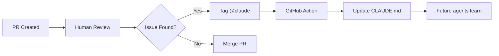
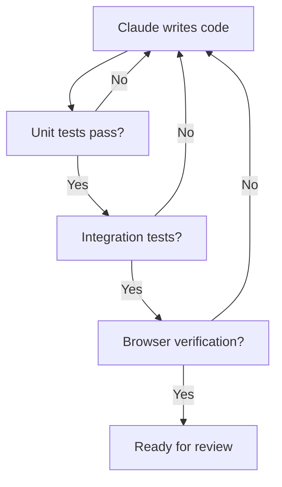

## TL;DR - Key Takeaways

1. **Run 5-10 Claude agents in parallel** across terminal and browser
2. **Use Opus 4.5 with thinking mode** - slower but requires less steering
3. **Maintain a CLAUDE.md file** as shared memory for mistakes and conventions
4. **Plan first, execute second** - don't let AI start coding until the plan is solid
5. **Verification is non-negotiable** - every change must be tested

---

## The Thread That Broke Developer Twitter

Boris Cherny ([@bcherny](https://x.com/bcherny)), the creator of Claude Code at Anthropic, recently shared his complete workflow for AI-assisted development. The numbers are staggering:

<blockquote class="twitter-tweet"><a href="https://twitter.com/bcherny/status/2007179832300581177"></a></blockquote>

In a 30-day period, Boris reported:
- **259 Pull Requests**
- **497 Commits**
- **~40,000 lines added**
- **~38,000 lines removed**

All written by Claude Code under his direction.

---

## The 10-Step Workflow

Let me break down each element of Boris's workflow and explain why it works.

### 1. Parallel Agent Instances

<blockquote class="twitter-tweet"><a href="https://twitter.com/bcherny/status/2007179833990885678"></a></blockquote>

Boris runs **5-10 Claude agents simultaneously**:

| Setup | Purpose |
|-------|---------|
| 5 Terminal instances | Each with separate git checkout |
| 5-10 Browser sessions | Via claude.ai/code |
| Mobile sessions | Start on phone, resume on desktop |

**Why this works**: Different agents handle different concerns—one refactors, one writes tests, one updates docs. No merge conflicts because each has its own branch.

**How to implement**:
```bash
# Create multiple working directories
git worktree add ../project-refactor feature/refactor
git worktree add ../project-tests feature/tests
git worktree add ../project-docs feature/docs

# Run Claude Code in each
cd ../project-refactor && claude
cd ../project-tests && claude
cd ../project-docs && claude
```

---

### 2. Model Choice: Opus 4.5 with Thinking

<blockquote class="twitter-tweet"><a href="https://twitter.com/bcherny/status/2007179836704600237"></a></blockquote>

Boris exclusively uses **Opus 4.5** (not Sonnet) with **thinking mode always on**.

| Model | Speed | Accuracy | Steering Needed |
|-------|-------|----------|-----------------|
| Sonnet | Fast | Good | More corrections |
| **Opus 4.5** | Slower | Better | Less steering |

**The insight**: Raw speed is a trap. A faster model that needs constant correction is slower than a deliberate model that gets it right the first time.

---

### 3. The CLAUDE.md File

<blockquote class="twitter-tweet"><a href="https://twitter.com/bcherny/status/2007179840848597422"></a></blockquote>

The **CLAUDE.md file** is the secret weapon. It's a living document of:

- Mistakes Claude should avoid
- Architectural preferences
- Naming conventions
- Project-specific patterns

**Example CLAUDE.md structure**:
```markdown
# CLAUDE.md - Project Guidelines

## Architecture
- Use functional components only
- State management via Zustand, not Redux
- All API calls go through /lib/api.ts

## Common Mistakes to Avoid
- Don't use `any` type in TypeScript
- Always handle loading and error states
- Never commit console.log statements

## Naming Conventions
- Components: PascalCase
- Hooks: useCamelCase
- Utils: camelCase

## Testing
- Every component needs a test file
- Use React Testing Library, not Enzyme
```

---

### 4. PR Reviews Update CLAUDE.md

<blockquote class="twitter-tweet"><a href="https://twitter.com/bcherny/status/2007179842928947333"></a></blockquote>

The team has **automated learning** built into their PR process:



**This is organizational memory at scale**. Every mistake becomes a lesson for all future Claude sessions.

---

### 5. Plan Mode First

<blockquote class="twitter-tweet"><a href="https://twitter.com/bcherny/status/2007179845336527000"></a></blockquote>

The workflow is **Plan → Refine → Execute**:

| Phase | Mode | Human Involvement |
|-------|------|-------------------|
| 1. Plan | Plan mode | High - back-and-forth |
| 2. Refine | Plan mode | Medium - clarifications |
| 3. Execute | Auto-accept | Low - monitoring |

**Why this matters**: Fixing a bad plan is cheap. Fixing bad code from a bad plan is expensive.

---

### 6. Slash Commands for Automation

<blockquote class="twitter-tweet"><a href="https://twitter.com/bcherny/status/2007179847949500714"></a></blockquote>

**Slash commands** turn common workflows into one-liners:

```
.claude/commands/
├── commit-push-pr.md
├── run-tests.md
├── format-all.md
├── deploy-staging.md
└── update-deps.md
```

**Example: commit-push-pr.md**
```markdown
# Commit, Push, and Create PR

1. Stage all changes
2. Generate commit message from diff
3. Push to current branch
4. Create PR with description from commits
5. Request review from team
```

---

### 7. Hooks for Continuous Automation

<blockquote class="twitter-tweet"><a href="https://twitter.com/bcherny/status/2007179850139000872"></a></blockquote>

**Hooks** trigger automation at specific points:

| Hook Type | Trigger | Example Use |
|-----------|---------|-------------|
| PostToolUse | After any tool runs | Auto-format code |
| PreToolUse | Before tool runs | Validate safety |
| Stop | When Claude stops | Run test suite |

---

### 8. Pre-Approved Permissions

<blockquote class="twitter-tweet"><a href="https://twitter.com/bcherny/status/2007179852047335529"></a></blockquote>

**Example .claude/settings.json**:
```json
{
  "permissions": {
    "allow": [
      "npm install",
      "npm run test",
      "npm run build",
      "git add",
      "git commit",
      "git push",
      "eslint --fix"
    ],
    "deny": [
      "rm -rf",
      "sudo",
      "npm publish"
    ]
  }
}
```

---

### 9. Tool Integrations

<blockquote class="twitter-tweet"><a href="https://twitter.com/bcherny/status/2007179854077407667"></a></blockquote>

Claude Code integrates with:

| Tool | Purpose |
|------|---------|
| **Slack** | Communication, status updates |
| **BigQuery** | Query production data |
| **Sentry** | Read error logs |
| **GitHub** | PR management |
| **Internal APIs** | Custom business logic |

---

### 10. Verification is #1

<blockquote class="twitter-tweet"><a href="https://twitter.com/bcherny/status/2007179856266789204"></a></blockquote>

**Verification is non-negotiable**:



---

## What Could Be Improved

While Boris's workflow is impressive, there are areas for enhancement:

### 1. Better Agent Coordination

Currently, parallel agents are isolated. Future improvements could include:

- **Shared context** between agents
- **Automatic task delegation** based on agent specialization
- **Conflict detection** before branches diverge too far

### 2. Learning Across Projects

CLAUDE.md is per-repo. What if learnings could be:

- **Shared across similar projects** (all React apps, all Python services)
- **Company-wide mistake databases**
- **Industry-wide best practice libraries**

### 3. Smarter Verification Pipelines

Current verification is manual to set up. Improvements:

- **Auto-detect what needs testing** based on changes
- **Visual regression testing** without configuration
- **Performance impact analysis** before merge

### 4. Better Rollback and Recovery

When an agent goes wrong:

- **Automatic checkpoint** before major changes
- **One-click rollback** to last known good state
- **Blame-aware debugging** showing which agent introduced bugs

### 5. Cost Optimization

Running 10 Opus 4.5 instances is expensive. Potential improvements:

- **Dynamic model selection** based on task complexity
- **Agent hibernation** when idle
- **Batch processing** for similar tasks

---

## How to Apply This Today

You don't need to be at Anthropic to use these techniques:

### Starter Setup

1. **Create a CLAUDE.md** in your repo
2. **Set up git worktrees** for parallel work
3. **Create your first slash command**
4. **Configure permissions** in settings

### Minimum Viable Workflow

```bash
# 1. Create CLAUDE.md
echo "# Project Guidelines\n\n## Rules\n- Use TypeScript\n- Write tests" > CLAUDE.md

# 2. Create commands directory
mkdir -p .claude/commands

# 3. Create a simple command
echo "Stage, commit with conventional message, push, create PR" > .claude/commands/ship.md

# 4. Start with plan mode
claude --plan "Add user authentication feature"
```

---

## Conclusion

Boris Cherny's workflow represents the cutting edge of AI-assisted development. The key insights:

1. **Quantity enables quality** - More agents mean more parallel progress
2. **Memory matters** - CLAUDE.md turns mistakes into organizational knowledge
3. **Plan before execute** - Upfront thinking saves downstream debugging
4. **Verify everything** - AI-written code needs the same scrutiny as human code
5. **Automate the repetitive** - Slash commands and hooks free you for high-value work

The future isn't AI replacing developers—it's developers orchestrating fleets of AI agents, each specialized, each learning, each contributing to a velocity previously impossible.

---

**Sources:**
- [Boris Cherny's Twitter Thread](https://twitter.com/bcherny/status/2007179832300581177)
- [How Boris Uses Claude Code](https://howborisusesclaudecode.com/)
- [Reddit Discussion on Claude Code Stats](https://www.reddit.com/r/ClaudeAI/comments/1px44q0/claude_code_creator_boris_cherny_reports_a_full/)

---

**Last Updated:** January 2026

**Questions?** Connect on [LinkedIn](https://www.linkedin.com/in/agrawal-sumit/) or [GitHub](https://github.com/tech-sumit).
