## TL;DR - Key Takeaways

1. **Edge AI runs ML models locally** on devices, not in the cloud
2. **Three key benefits**: Privacy (data stays on device), Speed (no network latency), Reliability (works offline)
3. **NPUs are driving adoption** - Dedicated AI chips now in laptops, phones, and IoT devices
4. **Model optimization is critical** - Quantization, pruning, and distillation make models edge-ready
5. **Major use cases**: Real-time translation, smart cameras, voice assistants, autonomous vehicles

---

## What Is Edge AI?

**Edge AI** (also called on-device AI or embedded AI) is the deployment of artificial intelligence algorithms directly on local devices—smartphones, laptops, IoT sensors, cameras—rather than relying on cloud servers for processing.

### Definition

> **Edge AI**: Machine learning inference performed locally on edge devices, enabling real-time AI capabilities without network connectivity or cloud dependencies.

### Edge vs Cloud AI

| Aspect | Cloud AI | Edge AI |
|--------|----------|---------|
| **Processing location** | Remote data centers | Local device |
| **Latency** | 50-500ms+ | <10ms |
| **Privacy** | Data leaves device | Data stays on device |
| **Internet required** | Yes | No |
| **Compute power** | Unlimited | Device-limited |
| **Cost per inference** | Pay per use | Hardware cost only |
| **Updates** | Server-side | Device updates needed |

---

## Why Edge AI Is Exploding in 2026

### The Perfect Storm of Enabling Technologies

Several converging trends have made Edge AI viable at scale:

#### 1. NPU Hardware Maturation

Modern devices now include dedicated Neural Processing Units:

| Device | NPU | Performance |
|--------|-----|-------------|
| iPhone 16 | Apple Neural Engine | 38 TOPS |
| AMD Ryzen AI 400 | XDNA 2 | 50 TOPS |
| Intel Panther Lake | Intel AI Engine | 45 TOPS |
| Google Tensor G4 | Google TPU | 32 TOPS |
| Qualcomm Snapdragon X | Hexagon NPU | 45 TOPS |

#### 2. Model Optimization Breakthroughs

Techniques that make large models run on small devices:

- **Quantization**: Reduce precision from 32-bit to 8-bit or 4-bit
- **Pruning**: Remove unnecessary neural network connections
- **Distillation**: Train smaller models to mimic larger ones
- **Architecture search**: Design efficient model architectures

#### 3. Regulatory Pressure

Privacy regulations increasingly favor local processing:

- GDPR (Europe): Strict data transfer requirements
- CCPA (California): Consumer data rights
- PIPL (China): Data localization requirements

---

## The Case for Edge AI

### 1. Privacy: Data Never Leaves the Device

For sensitive applications, Edge AI is a game-changer:

```mermaid
flowchart LR
    subgraph Cloud["☁️ Cloud AI Flow"]
        A1[User speaks] --> A2[Audio sent to cloud]
        A2 --> A3[Transcribed remotely]
        A3 --> A4[Text returned]
    end
    
    subgraph Edge["📱 Edge AI Flow"]
        B1[User speaks] --> B2[Audio processed locally]
        B2 --> B3[Text generated on-device]
    end
```



| Flow | Privacy | Latency |
|------|---------|---------|
| **Cloud AI** | ⚠️ Audio traverses internet, stored on servers | 200-500ms |
| **Edge AI** | ✅ Audio never leaves the device | <50ms |

**Privacy-critical use cases**:
- Medical diagnostics
- Financial transactions
- Personal assistants
- Home security cameras

### 2. Speed: Eliminate Network Latency

Edge AI enables real-time responsiveness:

| Application | Cloud Latency | Edge Latency | Improvement |
|-------------|--------------|--------------|-------------|
| Voice command | 200-500ms | <50ms | 4-10x faster |
| Object detection | 100-300ms | 10-30ms | 3-10x faster |
| Text suggestion | 150-400ms | <20ms | 7-20x faster |
| AR overlay | Unusable | <16ms | Real-time enabled |

### 3. Reliability: Works Without Internet

Edge AI operates independently:

- No connectivity required
- No server outages
- No API rate limits
- Consistent performance

### 4. Cost: No Per-Inference Charges

| Model | Cloud Cost (per 1M inferences) | Edge Cost |
|-------|-------------------------------|-----------|
| Text classification | $10-50 | $0 (one-time HW) |
| Image recognition | $50-200 | $0 (one-time HW) |
| Speech-to-text | $100-500 | $0 (one-time HW) |

---

## Edge AI Technical Stack

### Hardware Options

#### Dedicated NPUs

| NPU | Best For | Power |
|-----|----------|-------|
| Apple Neural Engine | iOS apps | ~5W |
| Intel AI Engine | Windows laptops | ~15W |
| AMD XDNA | Windows laptops | ~15W |
| Google Edge TPU | IoT, embedded | ~2W |
| Qualcomm Hexagon | Android, IoT | ~5W |

#### GPUs for Edge

| GPU | Use Case | Power |
|-----|----------|-------|
| NVIDIA Jetson Orin | Robotics, vehicles | 15-60W |
| NVIDIA Jetson Nano | Hobbyist, prototypes | 5-10W |
| Intel Arc (iGPU) | Laptops | ~15W |
| AMD RDNA (iGPU) | Laptops | ~15W |

#### Microcontrollers

| MCU | Use Case | Power |
|-----|----------|-------|
| Arduino Nano 33 BLE | Tiny ML | ~20mW |
| ESP32-S3 | IoT sensors | ~150mW |
| Raspberry Pi Pico | Embedded | ~50mW |

### Software Frameworks

#### Model Optimization

```python
# TensorFlow Lite Quantization Example
import tensorflow as tf

# Convert to TFLite with quantization
converter = tf.lite.TFLiteConverter.from_saved_model('model/')

# Dynamic range quantization (simplest)
converter.optimizations = [tf.lite.Optimize.DEFAULT]

# Full integer quantization (most efficient)
def representative_dataset():
    for data in calibration_data:
        yield [data]

converter.representative_dataset = representative_dataset
converter.target_spec.supported_ops = [tf.lite.OpsSet.TFLITE_BUILTINS_INT8]
converter.inference_input_type = tf.int8
converter.inference_output_type = tf.int8

# Convert
tflite_model = converter.convert()

# Size comparison
print(f"Original: {original_size}MB, Quantized: {len(tflite_model)/1e6:.1f}MB")
```

#### Inference Frameworks

| Framework | Platforms | Best For |
|-----------|-----------|----------|
| **TensorFlow Lite** | Android, iOS, embedded | General mobile/IoT |
| **ONNX Runtime** | Cross-platform | Model portability |
| **Core ML** | Apple devices | iOS/macOS apps |
| **OpenVINO** | Intel hardware | Intel NPU optimization |
| **NCNN** | Mobile | Lightweight, fast |
| **MLC LLM** | Multiple | On-device LLMs |

---

## Practical Implementation Guide

### Running an LLM on Device

With 2026 hardware, running small LLMs locally is practical:

```python
# Using MLC LLM for on-device inference
from mlc_llm import MLCEngine

# Initialize with quantized model
engine = MLCEngine(
    model="Llama-3-8B-Instruct-q4f16_1",  # 4-bit quantized
    device="npu"  # Use device NPU
)

# Generate response (all local)
response = engine.chat.completions.create(
    messages=[{"role": "user", "content": "Explain quantum computing briefly"}],
    max_tokens=150
)

print(response.choices[0].message.content)
```

### Real-Time Object Detection

```python
# TensorFlow Lite object detection on edge device
import tensorflow as tf
import numpy as np

# Load quantized model
interpreter = tf.lite.Interpreter(model_path='ssd_mobilenet_v2_int8.tflite')
interpreter.allocate_tensors()

# Get input/output details
input_details = interpreter.get_input_details()
output_details = interpreter.get_output_details()

def detect_objects(image):
    # Preprocess
    input_data = preprocess(image)
    interpreter.set_tensor(input_details[0]['index'], input_data)
    
    # Run inference (on NPU if available)
    interpreter.invoke()
    
    # Get results
    boxes = interpreter.get_tensor(output_details[0]['index'])
    classes = interpreter.get_tensor(output_details[1]['index'])
    scores = interpreter.get_tensor(output_details[2]['index'])
    
    return boxes, classes, scores

# Inference time: ~10-30ms on modern NPU
```

### Voice Recognition on Device

```javascript
// Web Speech API with on-device processing (where supported)
const recognition = new webkitSpeechRecognition();
recognition.continuous = true;
recognition.interimResults = true;

// Modern browsers use on-device processing when available
recognition.onresult = (event) => {
    const transcript = event.results[event.results.length - 1][0].transcript;
    console.log('Heard:', transcript);
};

recognition.start();
```

---

## Model Optimization Techniques

### Quantization Deep Dive

Reduce model precision to decrease size and increase speed:

| Precision | Bits | Size Reduction | Accuracy Impact |
|-----------|------|----------------|-----------------|
| FP32 (original) | 32 | 1x | Baseline |
| FP16 | 16 | 2x | Minimal |
| INT8 | 8 | 4x | Small (<1%) |
| INT4 | 4 | 8x | Moderate (1-3%) |

### Pruning

Remove unimportant weights:

```python
import tensorflow_model_optimization as tfmot

# Apply pruning to model
prune_low_magnitude = tfmot.sparsity.keras.prune_low_magnitude

pruning_params = {
    'pruning_schedule': tfmot.sparsity.keras.PolynomialDecay(
        initial_sparsity=0.0,
        final_sparsity=0.5,  # 50% of weights removed
        begin_step=0,
        end_step=1000
    )
}

pruned_model = prune_low_magnitude(model, **pruning_params)
```

### Knowledge Distillation

Train a smaller "student" model to mimic a larger "teacher":

```python
def distillation_loss(y_true, y_pred, teacher_pred, temperature=3.0, alpha=0.7):
    # Hard label loss
    hard_loss = tf.keras.losses.categorical_crossentropy(y_true, y_pred)
    
    # Soft label loss (knowledge from teacher)
    soft_loss = tf.keras.losses.KLDivergence()(
        tf.nn.softmax(teacher_pred / temperature),
        tf.nn.softmax(y_pred / temperature)
    ) * (temperature ** 2)
    
    return alpha * soft_loss + (1 - alpha) * hard_loss
```

---

## Edge AI Use Cases in 2026

### Consumer Applications

| Application | Edge AI Benefit |
|-------------|-----------------|
| **Smartphone photography** | Real-time HDR, portrait mode, night mode |
| **Voice assistants** | Offline wake word, local commands |
| **Real-time translation** | Live conversation translation |
| **Smart compose** | Predictive text, autocomplete |
| **Fitness tracking** | Activity recognition, health monitoring |

### Industrial Applications

| Application | Edge AI Benefit |
|-------------|-----------------|
| **Quality inspection** | Real-time defect detection on factory line |
| **Predictive maintenance** | Sensor analysis for equipment failure |
| **Autonomous vehicles** | Real-time object detection and navigation |
| **Robotics** | Local decision-making, navigation |
| **Smart agriculture** | Crop health monitoring, irrigation |

### Healthcare Applications

| Application | Edge AI Benefit |
|-------------|-----------------|
| **Medical imaging** | On-device diagnostic assistance |
| **Wearable health** | Continuous vital monitoring |
| **Drug discovery** | Secure local data processing |
| **Patient monitoring** | Real-time anomaly detection |

---

## Challenges and Solutions

### Challenge 1: Model Size Constraints

**Problem**: Large models don't fit on edge devices

**Solutions**:
- Quantization (4-bit, 8-bit)
- Model pruning (remove 50-90% of weights)
- Architecture search for efficient designs
- Knowledge distillation

### Challenge 2: Power Consumption

**Problem**: Battery life concerns on mobile devices

**Solutions**:
- Use NPU instead of CPU/GPU when available
- Batch inference requests
- Implement intelligent activation (only run when needed)
- Use smaller models for preliminary filtering

### Challenge 3: Model Updates

**Problem**: Updating models on millions of devices

**Solutions**:
- Over-the-air (OTA) model updates
- Model versioning and rollback capability
- Differential updates (only changed weights)
- A/B testing infrastructure

### Challenge 4: Accuracy vs Efficiency Trade-off

**Problem**: Smaller models may be less accurate

**Solutions**:
- Hybrid edge-cloud: edge for speed, cloud for accuracy
- Confidence thresholds: fallback to cloud when uncertain
- Domain-specific optimization: focus on specific use cases

---

## Getting Started with Edge AI

### For Web Developers

```javascript
// TensorFlow.js - ML in the browser
import * as tf from '@tensorflow/tfjs';

// Load pre-trained model
const model = await tf.loadLayersModel('model/model.json');

// Run inference locally
const prediction = model.predict(tf.tensor2d([inputData]));
console.log('Prediction:', prediction.dataSync());
```

### For Mobile Developers

```swift
// Core ML on iOS
import CoreML

// Load model
let model = try! MobileNetV2(configuration: .init())

// Make prediction
let prediction = try! model.prediction(image: inputImage)
print("Classification: \(prediction.classLabel)")
```

### For IoT Developers

```c
// TensorFlow Lite Micro on Arduino
#include <TensorFlowLite.h>

// Load quantized model
const tflite::Model* model = tflite::GetModel(model_data);
tflite::MicroInterpreter interpreter(model, resolver, tensor_arena, arena_size);

// Run inference
interpreter.Invoke();
float* output = interpreter.output(0)->data.f;
```

---

## Frequently Asked Questions

### When should I use Edge AI vs Cloud AI?

Use **Edge AI** when: privacy is critical, latency matters (<100ms), offline operation needed, or high-volume inference makes cloud costs prohibitive.

Use **Cloud AI** when: you need maximum accuracy, model updates are frequent, compute requirements exceed device capability, or you're processing data from multiple sources.

### How much does Edge AI reduce latency?

Typical improvements:
- Voice commands: 200-500ms → 30-50ms
- Image classification: 100-300ms → 10-30ms
- Text prediction: 150-400ms → 10-20ms

### What model size can run on a smartphone?

On 2026 flagship phones:
- Small models (MobileNet): <50MB, instant inference
- Medium models (BERT-base): 100-500MB, ~100ms inference
- Small LLMs (7B quantized): 2-4GB, works on high-end devices

### Do I need special hardware for Edge AI?

No. Edge AI can run on CPU, but performance improves dramatically with NPU/GPU acceleration. Modern devices (phones, laptops) include dedicated AI accelerators.

### How do I update models on deployed devices?

- App store updates (mobile)
- OTA updates for IoT
- Progressive rollout with A/B testing
- Keep model separate from app binary for faster updates

---

## Conclusion

Edge AI represents a fundamental shift in how we deploy machine learning—from centralized cloud processing to distributed on-device intelligence. The benefits are compelling:

- **Privacy**: Sensitive data never leaves the device
- **Speed**: Real-time responses without network latency
- **Reliability**: Works offline, no server dependencies
- **Cost**: No per-inference cloud charges

With NPUs now standard in laptops, phones, and IoT devices, and with optimized model formats making even LLMs edge-capable, 2026 is the year Edge AI goes mainstream.

For developers, the message is clear: learn model optimization, understand hardware capabilities, and design AI features with edge-first thinking.

---

**Last Updated:** January 2026

**Questions?** Connect on [LinkedIn](https://www.linkedin.com/in/agrawal-sumit/) or [GitHub](https://github.com/tech-sumit).
